# Arquitectura Completa de Huf

Huf es un framework de agentes de IA para Frappe/ERPNext. Permite crear agentes inteligentes que interactúan con usuarios, automatizan tareas y manipulan datos del ERP.

---

## Índice

1. [Visión General](#1-visión-general-del-sistema)
2. [Flujo Principal](#2-diagrama-de-flujo-principal)
3. [Modelo de Datos](#3-modelo-de-datos-frappe-doctypes)
4. [Integración Frappe](#4-integración-con-frappe-doc-events)
5. [Orquestación Multi-Step](#5-sistema-de-orquestación-multi-step)
6. [Proveedores IA](#6-proveedores-de-ia-litellm)
7. [Sistema RAG](#7-sistema-de-conocimiento-rag)
8. [Herramientas](#8-herramientas-sdk-tools)
9. [Componentes del Código](#9-componentes-del-código)
10. [Flujo de Herramientas](#10-flujo-de-ejecución-de-herramientas)
11. [Flujo de Chat](#11-flujo-detallado-del-chat)
12. [Flujo de Streaming](#12-flujo-de-streaming-sse)
13. [Flujo de Transcripción](#13-flujo-de-transcripción-de-audio)
14. [Flujo MCP](#14-flujo-de-mcp-model-context-protocol)
15. [Manejo de Errores](#15-manejo-de-errores)
16. [API Endpoints](#16-api-endpoints)
17. [Configuración](#17-configuración-requerida)

---

## 1. Visión General del Sistema

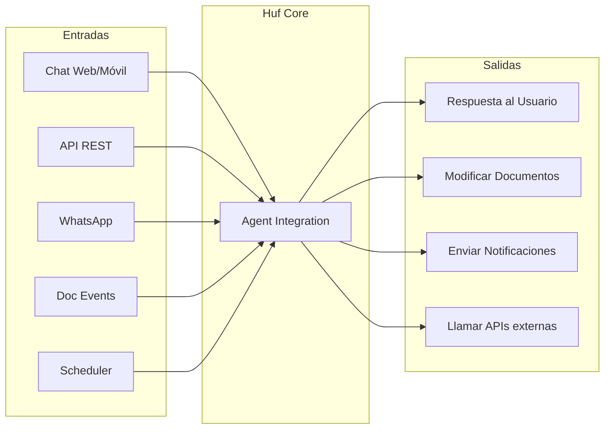
```mermaid
graph LR
    subgraph "Entradas"
        A[Chat Web/Móvil]
        B[API REST]
        C[WhatsApp]
        D[Doc Events]
        E[Scheduler]
    end

    subgraph "Huf Core"
        F[Agent Integration]
    end

    subgraph "Salidas"
        G[Respuesta al Usuario]
        H[Modificar Documentos]
        I[Enviar Notificaciones]
        J[Llamar APIs externas]
    end

    A --> F
    B --> F
    C --> F
    D --> F
    E --> F
    F --> G
    F --> H
    F --> I
    F --> J
```

---

## 2. Diagrama de Flujo Principal

Este diagrama muestra el ciclo completo de una solicitud de usuario.

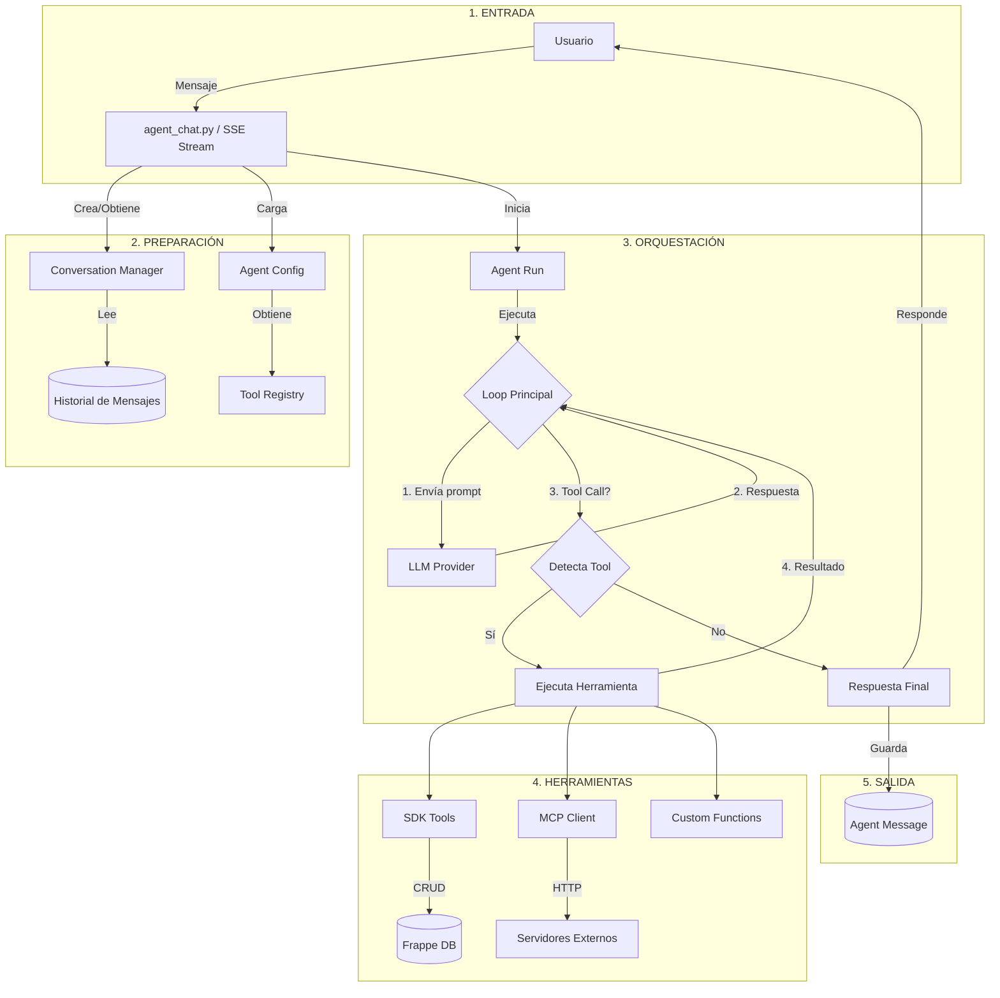
```mermaid
flowchart TD
    subgraph "1. ENTRADA"
        U[Usuario] -->|Mensaje| API
        API[agent_chat.py / SSE Stream]
    end

    subgraph "2. PREPARACIÓN"
        API -->|Crea/Obtiene| CONV[Conversation Manager]
        CONV -->|Lee| HIST[(Historial de Mensajes)]
        API -->|Carga| AGT[Agent Config]
        AGT -->|Obtiene| TOOLS[Tool Registry]
    end

    subgraph "3. ORQUESTACIÓN"
        API -->|Inicia| RUN[Agent Run]
        RUN -->|Ejecuta| LOOP{Loop Principal}
        
        LOOP -->|1. Envía prompt| LLM[LLM Provider]
        LLM -->|2. Respuesta| LOOP
        
        LOOP -->|3. Tool Call?| TC{Detecta Tool}
        TC -->|Sí| EXEC[Ejecuta Herramienta]
        EXEC -->|4. Resultado| LOOP
        
        TC -->|No| DONE[Respuesta Final]
    end

    subgraph "4. HERRAMIENTAS"
        EXEC --> SDK[SDK Tools]
        EXEC --> MCP[MCP Client]
        EXEC --> CUSTOM[Custom Functions]
        
        SDK -->|CRUD| DB[(Frappe DB)]
        MCP -->|HTTP| EXT[Servidores Externos]
    end

    subgraph "5. SALIDA"
        DONE -->|Guarda| MSG[(Agent Message)]
        DONE -->|Responde| U
    end
```

---

## 3. Modelo de Datos (Frappe DocTypes)

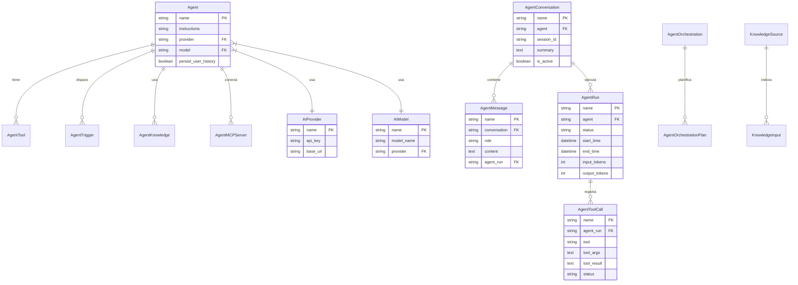
```mermaid
erDiagram
    Agent ||--o{ AgentTool : tiene
    Agent ||--o{ AgentTrigger : dispara
    Agent ||--o{ AgentKnowledge : usa
    Agent ||--o{ AgentMCPServer : conecta
    Agent }|--|| AIProvider : usa
    Agent }|--|| AIModel : usa
    
    AgentConversation ||--o{ AgentMessage : contiene
    AgentConversation ||--o{ AgentRun : ejecuta
    
    AgentRun ||--o{ AgentToolCall : registra
    
    AgentOrchestration ||--o{ AgentOrchestrationPlan : planifica
    
    KnowledgeSource ||--o{ KnowledgeInput : indexa

    Agent {
        string name PK
        string instructions
        string provider FK
        string model FK
        boolean persist_user_history
    }
    
    AgentConversation {
        string name PK
        string agent FK
        string session_id
        text summary
        boolean is_active
    }
    
    AgentMessage {
        string name PK
        string conversation FK
        string role
        text content
        string agent_run FK
    }
    
    AgentRun {
        string name PK
        string agent FK
        string status
        datetime start_time
        datetime end_time
        int input_tokens
        int output_tokens
    }
    
    AgentToolCall {
        string name PK
        string agent_run FK
        string tool
        text tool_args
        text tool_result
        string status
    }
    
    AIProvider {
        string name PK
        string api_key
        string base_url
    }
    
    AIModel {
        string name PK
        string model_name
        string provider FK
    }
```

### Descripción de DocTypes

| DocType | Descripción |
|---------|-------------|
| **Agent** | Configuración del agente: instrucciones, modelo, herramientas |
| **Agent Conversation** | Sesión de chat con historial |
| **Agent Message** | Mensaje individual (user/agent/tool) |
| **Agent Run** | Ejecución individual del agente con métricas |
| **Agent Tool Call** | Registro de cada llamada a herramienta |
| **Agent Trigger** | Automatización por eventos de documentos |
| **Agent Orchestration** | Ejecución multi-paso planificada |
| **AI Provider** | Configuración del proveedor (OpenAI, Anthropic, etc.) |
| **AI Model** | Modelo específico vinculado a un proveedor |
| **MCP Server** | Servidor MCP externo conectado |
| **Knowledge Source** | Fuente de conocimiento para RAG |

---

## 4. Integración con Frappe (Doc Events)

El sistema se conecta automáticamente a todos los eventos de documentos de Frappe.

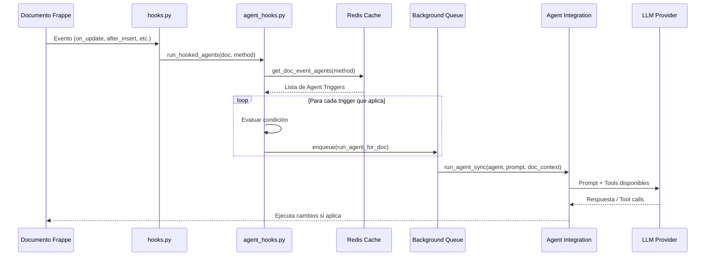
```mermaid
sequenceDiagram
    participant Doc as Documento Frappe
    participant Hook as hooks.py
    participant AH as agent_hooks.py
    participant Cache as Redis Cache
    participant Queue as Background Queue
    participant AI as Agent Integration
    participant LLM as LLM Provider

    Doc->>Hook: Evento (on_update, after_insert, etc.)
    Hook->>AH: run_hooked_agents(doc, method)
    AH->>Cache: get_doc_event_agents(method)
    Cache-->>AH: Lista de Agent Triggers
    
    loop Para cada trigger que aplica
        AH->>AH: Evaluar condición
        AH->>Queue: enqueue(run_agent_for_doc)
    end
    
    Queue->>AI: run_agent_sync(agent, prompt, doc_context)
    AI->>LLM: Prompt + Tools disponibles
    LLM-->>AI: Respuesta / Tool calls
    AI-->>Doc: Ejecuta cambios si aplica
```

### Eventos Soportados

- `before_insert` / `after_insert`
- `before_save` / `after_save`
- `validate`
- `on_update`
- `before_submit` / `after_submit` / `on_submit`
- `before_cancel`
- `before_rename` / `after_rename`
- `on_trash` / `after_delete`

---

## 5. Sistema de Orquestación (Multi-Step)

Para tareas complejas que requieren múltiples pasos.

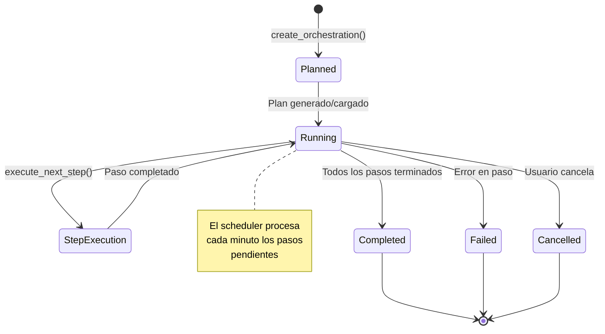
```mermaid
stateDiagram-v2
    [*] --> Planned: create_orchestration()
    Planned --> Running: Plan generado/cargado
    
    Running --> StepExecution: execute_next_step()
    StepExecution --> Running: Paso completado
    
    Running --> Completed: Todos los pasos terminados
    Running --> Failed: Error en paso
    Running --> Cancelled: Usuario cancela
    
    Completed --> [*]
    Failed --> [*]
    Cancelled --> [*]

    note right of Running
        El scheduler procesa
        cada minuto los pasos
        pendientes
    end note
```

### Flujo de Orquestación Detallado

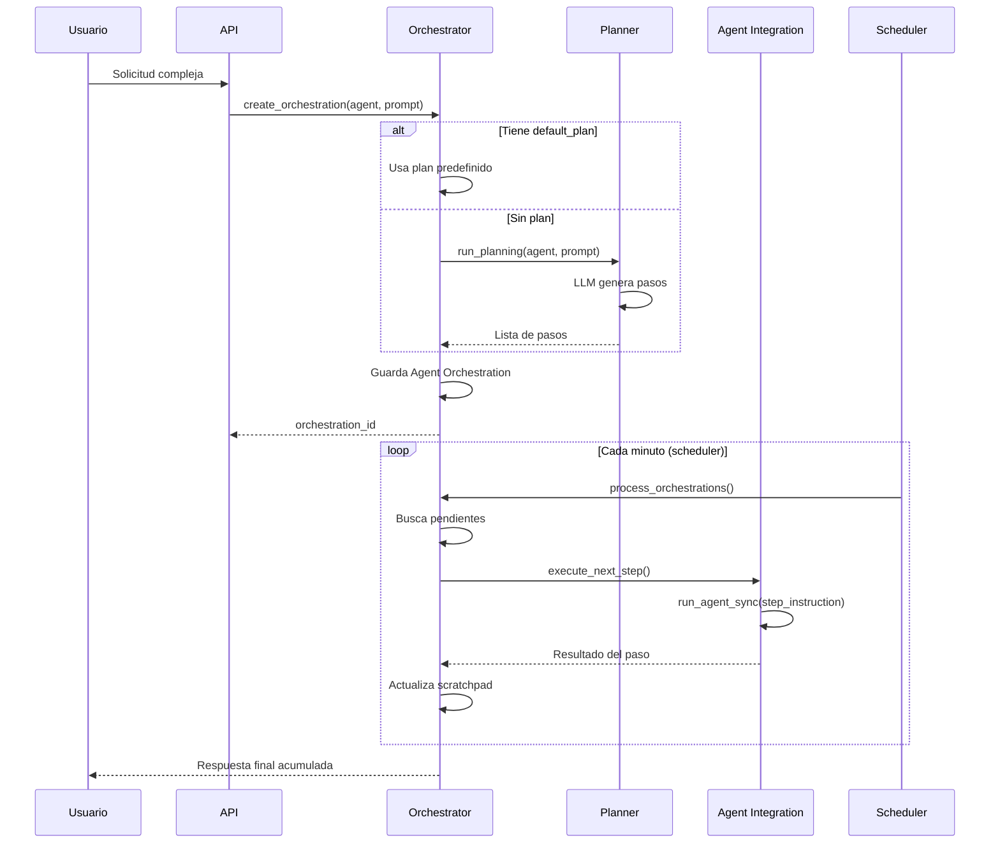
```mermaid
sequenceDiagram
    participant User as Usuario
    participant API as API
    participant Orch as Orchestrator
    participant Plan as Planner
    participant Agent as Agent Integration
    participant Sched as Scheduler

    User->>API: Solicitud compleja
    API->>Orch: create_orchestration(agent, prompt)
    
    alt Tiene default_plan
        Orch->>Orch: Usa plan predefinido
    else Sin plan
        Orch->>Plan: run_planning(agent, prompt)
        Plan->>Plan: LLM genera pasos
        Plan-->>Orch: Lista de pasos
    end
    
    Orch->>Orch: Guarda Agent Orchestration
    Orch-->>API: orchestration_id
    
    loop Cada minuto (scheduler)
        Sched->>Orch: process_orchestrations()
        Orch->>Orch: Busca pendientes
        Orch->>Agent: execute_next_step()
        Agent->>Agent: run_agent_sync(step_instruction)
        Agent-->>Orch: Resultado del paso
        Orch->>Orch: Actualiza scratchpad
    end
    
    Orch-->>User: Respuesta final acumulada
```

---

## 6. Proveedores de IA (LiteLLM)

Huf usa LiteLLM como capa de abstracción para múltiples proveedores.

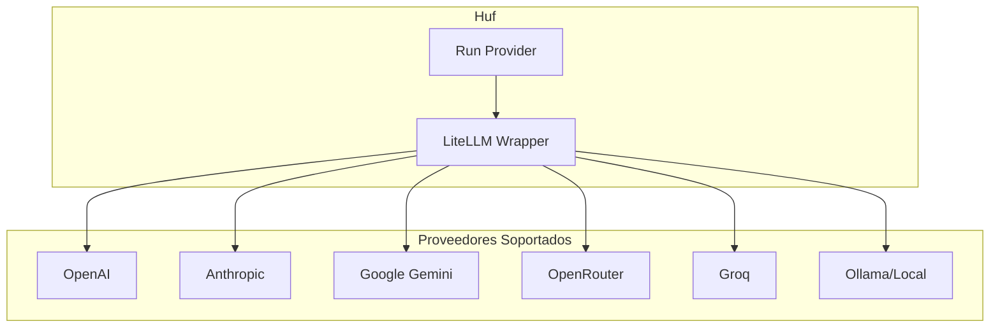
```mermaid
graph TD
    subgraph "Huf"
        RP[Run Provider]
        LL[LiteLLM Wrapper]
    end
    
    subgraph "Proveedores Soportados"
        OAI[OpenAI]
        ANT[Anthropic]
        GGL[Google Gemini]
        OR[OpenRouter]
        GRQ[Groq]
        LOCAL[Ollama/Local]
    end
    
    RP --> LL
    LL --> OAI
    LL --> ANT
    LL --> GGL
    LL --> OR
    LL --> GRQ
    LL --> LOCAL
```

### Flujo de Selección de Proveedor

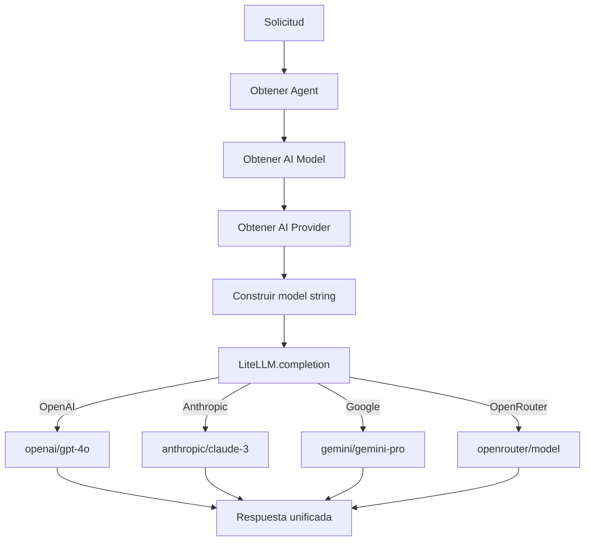
```mermaid
flowchart TD
    START[Solicitud] --> GET_AGENT[Obtener Agent]
    GET_AGENT --> GET_MODEL[Obtener AI Model]
    GET_MODEL --> GET_PROVIDER[Obtener AI Provider]
    GET_PROVIDER --> BUILD[Construir model string]
    BUILD --> LITELLM[LiteLLM.completion]
    
    LITELLM --> |OpenAI| OAI[openai/gpt-4o]
    LITELLM --> |Anthropic| ANT[anthropic/claude-3]
    LITELLM --> |Google| GGL[gemini/gemini-pro]
    LITELLM --> |OpenRouter| OR[openrouter/model]
    
    OAI --> RESPONSE[Respuesta unificada]
    ANT --> RESPONSE
    GGL --> RESPONSE
    OR --> RESPONSE
```

---

## 7. Sistema de Conocimiento (RAG)

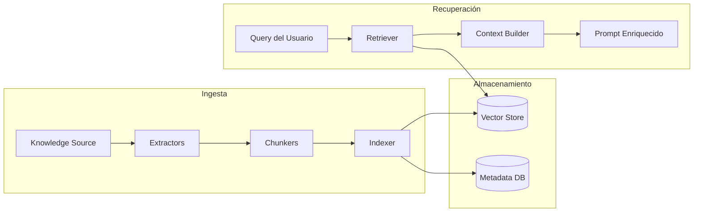
```mermaid
flowchart LR
    subgraph "Ingesta"
        SRC[Knowledge Source]
        SRC --> EXT[Extractors]
        EXT --> CHK[Chunkers]
        CHK --> IDX[Indexer]
    end
    
    subgraph "Almacenamiento"
        IDX --> VEC[(Vector Store)]
        IDX --> META[(Metadata DB)]
    end
    
    subgraph "Recuperación"
        QUERY[Query del Usuario]
        QUERY --> RET[Retriever]
        RET --> VEC
        RET --> CTX[Context Builder]
        CTX --> PROMPT[Prompt Enriquecido]
    end
```

### Flujo RAG Detallado

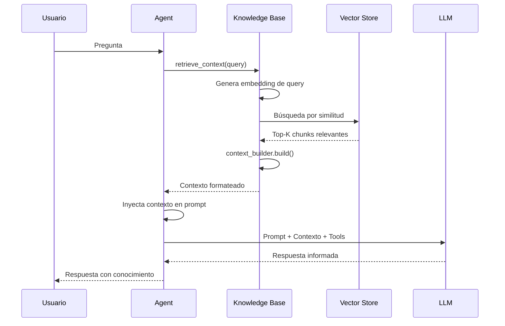
```mermaid
sequenceDiagram
    participant User as Usuario
    participant Agent as Agent
    participant KB as Knowledge Base
    participant VEC as Vector Store
    participant LLM as LLM

    User->>Agent: Pregunta
    Agent->>KB: retrieve_context(query)
    KB->>KB: Genera embedding de query
    KB->>VEC: Búsqueda por similitud
    VEC-->>KB: Top-K chunks relevantes
    KB->>KB: context_builder.build()
    KB-->>Agent: Contexto formateado
    Agent->>Agent: Inyecta contexto en prompt
    Agent->>LLM: Prompt + Contexto + Tools
    LLM-->>Agent: Respuesta informada
    Agent-->>User: Respuesta con conocimiento
```

### Extractores Soportados

| Tipo | Formato | Descripción |
|------|---------|-------------|
| **Text** | `.txt`, `.md` | Texto plano |
| **PDF** | `.pdf` | Documentos PDF |
| **Web** | `http://` | Páginas web (scraping) |
| **DocType** | Frappe | Datos de documentos |

---

## 8. Herramientas (SDK Tools)

Las herramientas disponibles para los agentes:

| Tipo | Herramientas | Descripción |
|------|-------------|-------------|
| **CRUD** | `get_document`, `create_document`, `update_document`, `delete_document` | Operaciones básicas sobre DocTypes |
| **Listas** | `get_list`, `search_documents` | Búsqueda y filtrado |
| **Acciones** | `submit_document`, `cancel_document`, `run_method` | Acciones de workflow |
| **Utilidades** | `send_email`, `create_notification` | Comunicación |
| **MCP** | Herramientas externas vía MCP Protocol | Integración con servidores externos |
| **Custom** | `Agent Tool Function` | Funciones Python personalizadas |

### Tipos de Herramientas

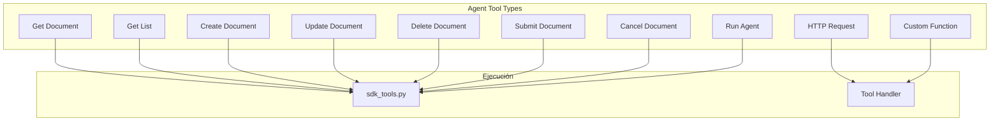
```mermaid
graph TD
    subgraph "Agent Tool Types"
        GET_DOC[Get Document]
        GET_LIST[Get List]
        CREATE[Create Document]
        UPDATE[Update Document]
        DELETE[Delete Document]
        SUBMIT[Submit Document]
        CANCEL[Cancel Document]
        RUN_AGENT[Run Agent]
        HTTP[HTTP Request]
        CUSTOM[Custom Function]
    end
    
    subgraph "Ejecución"
        SDK[sdk_tools.py]
        HANDLER[Tool Handler]
    end
    
    GET_DOC --> SDK
    GET_LIST --> SDK
    CREATE --> SDK
    UPDATE --> SDK
    DELETE --> SDK
    SUBMIT --> SDK
    CANCEL --> SDK
    RUN_AGENT --> SDK
    HTTP --> HANDLER
    CUSTOM --> HANDLER
```

---

## 9. Componentes del Código

| Archivo | Función |
|---------|---------|
| `agent_integration.py` | Loop principal del agente, maneja tool calls |
| `agent_chat.py` | API REST para el chat |
| `agent_stream_renderer.py` | SSE streaming para respuestas en tiempo real |
| `agent_hooks.py` | Integración con eventos de documentos |
| `agent_scheduler.py` | Ejecución programada de agentes |
| `sdk_tools.py` | Definición de herramientas Frappe |
| `tool_registry.py` | Registro y sincronización de herramientas |
| `tool_functions.py` | Implementación de funciones CRUD |
| `mcp_client.py` | Cliente para servidores MCP externos |
| `conversation_manager.py` | Gestión de historial y contexto |
| `transcription_handler.py` | Manejo de audio a texto |
| `orchestration/orchestrator.py` | Sistema de orquestación multi-paso |
| `orchestration/planning.py` | Generación de planes |
| `orchestration/scheduler.py` | Procesamiento de orquestaciones |
| `knowledge/indexer.py` | Indexación de conocimiento |
| `knowledge/retriever.py` | Recuperación de contexto |
| `knowledge/context_builder.py` | Construcción de contexto |
| `providers/litellm.py` | Wrapper unificado para LLMs |

---

## 10. Flujo de Ejecución de Herramientas

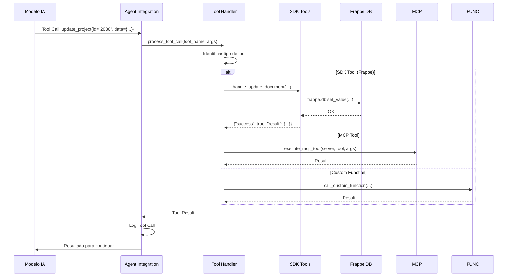
```mermaid
sequenceDiagram
    participant LLM as Modelo IA
    participant AI as Agent Integration
    participant TH as Tool Handler
    participant SDK as SDK Tools
    participant DB as Frappe DB

    LLM->>AI: Tool Call: update_project(id="2036", data={...})
    AI->>TH: process_tool_call(tool_name, args)
    TH->>TH: Identificar tipo de tool
    
    alt SDK Tool (Frappe)
        TH->>SDK: handle_update_document(...)
        SDK->>DB: frappe.db.set_value(...)
        DB-->>SDK: OK
        SDK-->>TH: {"success": true, "result": {...}}
    else MCP Tool
        TH->>MCP: execute_mcp_tool(server, tool, args)
        MCP-->>TH: Result
    else Custom Function
        TH->>FUNC: call_custom_function(...)
        FUNC-->>TH: Result
    end
    
    TH-->>AI: Tool Result
    AI->>AI: Log Tool Call
    AI->>LLM: Resultado para continuar
```

---

## 11. Flujo Detallado del Chat

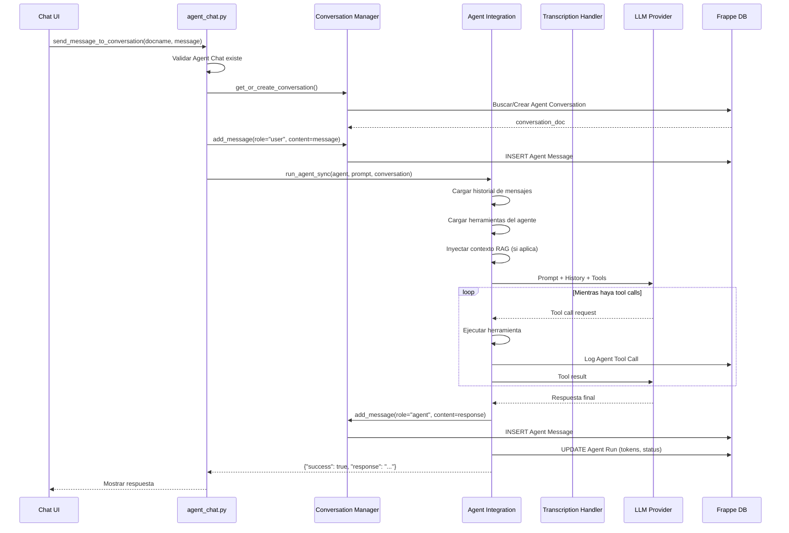
```mermaid
sequenceDiagram
    participant UI as Chat UI
    participant API as agent_chat.py
    participant CM as Conversation Manager
    participant AI as Agent Integration
    participant TH as Transcription Handler
    participant LLM as LLM Provider
    participant DB as Frappe DB

    UI->>API: send_message_to_conversation(docname, message)
    API->>API: Validar Agent Chat existe
    API->>CM: get_or_create_conversation()
    CM->>DB: Buscar/Crear Agent Conversation
    DB-->>CM: conversation_doc
    
    API->>CM: add_message(role="user", content=message)
    CM->>DB: INSERT Agent Message
    
    API->>AI: run_agent_sync(agent, prompt, conversation)
    AI->>AI: Cargar historial de mensajes
    AI->>AI: Cargar herramientas del agente
    AI->>AI: Inyectar contexto RAG (si aplica)
    
    AI->>LLM: Prompt + History + Tools
    
    loop Mientras haya tool calls
        LLM-->>AI: Tool call request
        AI->>AI: Ejecutar herramienta
        AI->>DB: Log Agent Tool Call
        AI->>LLM: Tool result
    end
    
    LLM-->>AI: Respuesta final
    AI->>CM: add_message(role="agent", content=response)
    CM->>DB: INSERT Agent Message
    AI->>DB: UPDATE Agent Run (tokens, status)
    
    AI-->>API: {"success": true, "response": "..."}
    API-->>UI: Mostrar respuesta
```

---

## 12. Flujo de Streaming (SSE)

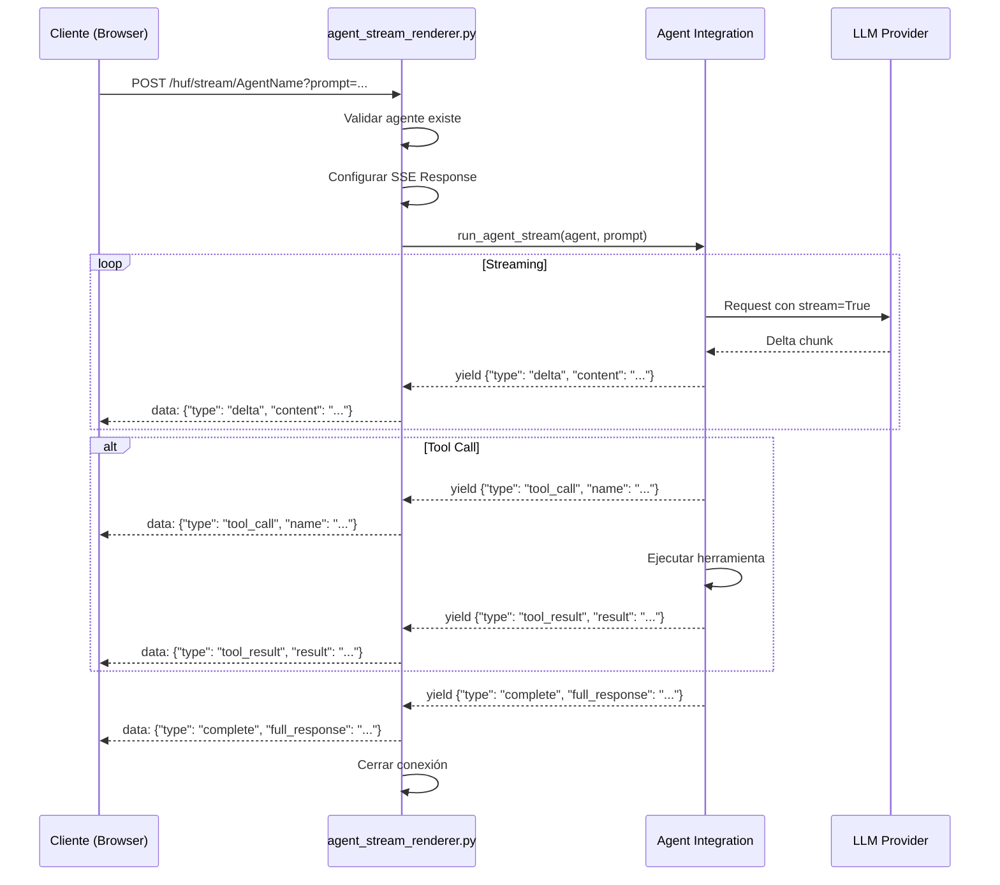
```mermaid
sequenceDiagram
    participant UI as Cliente (Browser)
    participant SSE as agent_stream_renderer.py
    participant AI as Agent Integration
    participant LLM as LLM Provider

    UI->>SSE: POST /huf/stream/AgentName?prompt=...
    SSE->>SSE: Validar agente existe
    SSE->>SSE: Configurar SSE Response
    
    SSE->>AI: run_agent_stream(agent, prompt)
    
    loop Streaming
        AI->>LLM: Request con stream=True
        LLM-->>AI: Delta chunk
        AI-->>SSE: yield {"type": "delta", "content": "..."}
        SSE-->>UI: data: {"type": "delta", "content": "..."}
    end
    
    alt Tool Call
        AI-->>SSE: yield {"type": "tool_call", "name": "..."}
        SSE-->>UI: data: {"type": "tool_call", "name": "..."}
        AI->>AI: Ejecutar herramienta
        AI-->>SSE: yield {"type": "tool_result", "result": "..."}
        SSE-->>UI: data: {"type": "tool_result", "result": "..."}
    end
    
    AI-->>SSE: yield {"type": "complete", "full_response": "..."}
    SSE-->>UI: data: {"type": "complete", "full_response": "..."}
    SSE->>SSE: Cerrar conexión
```

---

## 13. Flujo de Transcripción de Audio

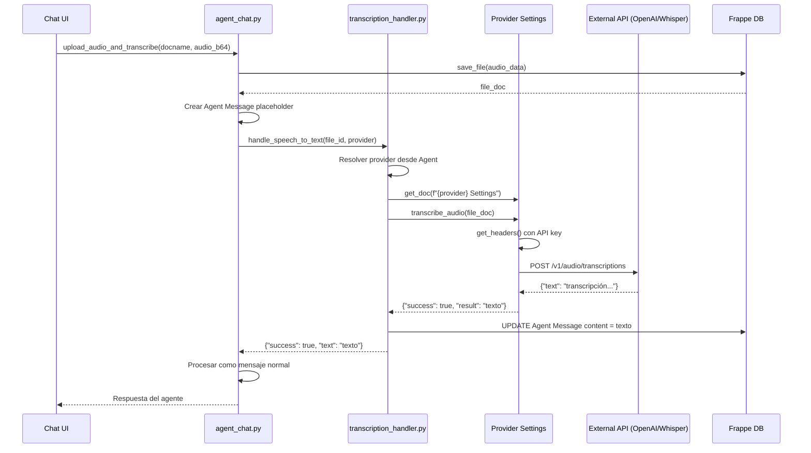
```mermaid
sequenceDiagram
    participant UI as Chat UI
    participant API as agent_chat.py
    participant TH as transcription_handler.py
    participant PROV as Provider Settings
    participant EXT as External API (OpenAI/Whisper)
    participant DB as Frappe DB

    UI->>API: upload_audio_and_transcribe(docname, audio_b64)
    API->>DB: save_file(audio_data)
    DB-->>API: file_doc
    
    API->>API: Crear Agent Message placeholder
    API->>TH: handle_speech_to_text(file_id, provider)
    
    TH->>TH: Resolver provider desde Agent
    TH->>PROV: get_doc(f"{provider} Settings")
    TH->>PROV: transcribe_audio(file_doc)
    
    PROV->>PROV: get_headers() con API key
    PROV->>EXT: POST /v1/audio/transcriptions
    EXT-->>PROV: {"text": "transcripción..."}
    
    PROV-->>TH: {"success": true, "result": "texto"}
    TH->>DB: UPDATE Agent Message content = texto
    TH-->>API: {"success": true, "text": "texto"}
    
    API->>API: Procesar como mensaje normal
    API-->>UI: Respuesta del agente
```

---

## 14. Flujo de MCP (Model Context Protocol)

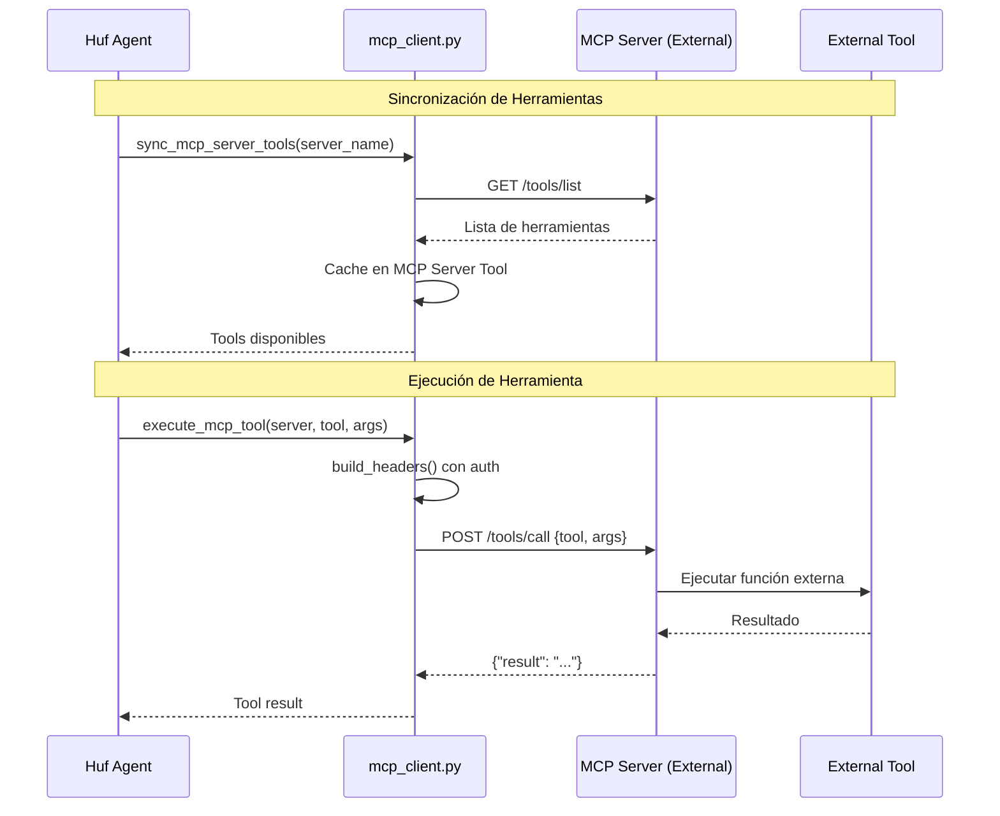
```mermaid
sequenceDiagram
    participant Agent as Huf Agent
    participant MCP as mcp_client.py
    participant Server as MCP Server (External)
    participant Tool as External Tool

    Note over Agent,Tool: Sincronización de Herramientas
    Agent->>MCP: sync_mcp_server_tools(server_name)
    MCP->>Server: GET /tools/list
    Server-->>MCP: Lista de herramientas
    MCP->>MCP: Cache en MCP Server Tool
    MCP-->>Agent: Tools disponibles

    Note over Agent,Tool: Ejecución de Herramienta
    Agent->>MCP: execute_mcp_tool(server, tool, args)
    MCP->>MCP: build_headers() con auth
    MCP->>Server: POST /tools/call {tool, args}
    Server->>Tool: Ejecutar función externa
    Tool-->>Server: Resultado
    Server-->>MCP: {"result": "..."}
    MCP-->>Agent: Tool result
```

---

## 15. Manejo de Errores

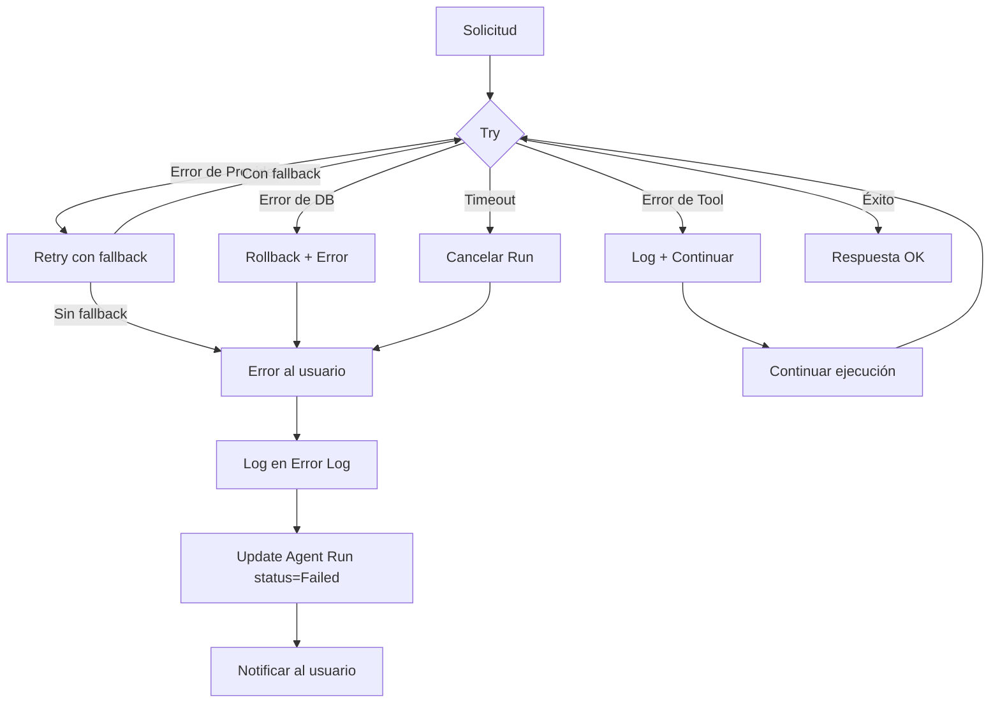
```mermaid
flowchart TD
    START[Solicitud] --> TRY{Try}
    
    TRY -->|Error de Provider| E1[Retry con fallback]
    TRY -->|Error de Tool| E2[Log + Continuar]
    TRY -->|Error de DB| E3[Rollback + Error]
    TRY -->|Timeout| E4[Cancelar Run]
    TRY -->|Éxito| SUCCESS[Respuesta OK]
    
    E1 --> |Sin fallback| FAIL[Error al usuario]
    E1 --> |Con fallback| TRY
    
    E2 --> CONT[Continuar ejecución]
    CONT --> TRY
    
    E3 --> FAIL
    E4 --> FAIL
    
    FAIL --> LOG[Log en Error Log]
    LOG --> UPDATE[Update Agent Run status=Failed]
    UPDATE --> NOTIFY[Notificar al usuario]
```

### Códigos de Error

| Código | Descripción |
|--------|-------------|
| `AGENT_NOT_FOUND` | Agente no existe |
| `PROVIDER_ERROR` | Error del proveedor de IA |
| `TOOL_EXECUTION_ERROR` | Error al ejecutar herramienta |
| `PERMISSION_DENIED` | Sin permisos para la acción |
| `VALIDATION_ERROR` | Datos inválidos |
| `TIMEOUT` | Tiempo de espera agotado |

---

## 16. API Endpoints

### REST API

| Método | Endpoint | Descripción |
|--------|----------|-------------|
| `POST` | `/api/method/huf.ai.agent_chat.send_message_to_conversation` | Enviar mensaje |
| `POST` | `/api/method/huf.ai.agent_chat.upload_audio_and_transcribe` | Subir audio |
| `GET` | `/api/method/huf.ai.agent_chat.get_conversation_messages` | Obtener historial |

### SSE Streaming

| Método | Endpoint | Descripción |
|--------|----------|-------------|
| `POST` | `/huf/stream/{agent_name}` | Streaming de respuesta |
| `GET` | `/huf/stream` | Página de prueba |

### Parámetros de Streaming

```json
{
  "prompt": "Tu mensaje aquí",
  "conversation_id": "opcional-id",
  "channel_id": "web",
  "external_id": "user@example.com"
}
```

### Formato de Eventos SSE

```javascript
// Delta de texto
{"type": "delta", "content": "Hola", "full_response": "Hola"}

// Llamada a herramienta
{"type": "tool_call", "tool": "get_project", "args": {"id": "2036"}}

// Resultado de herramienta
{"type": "tool_result", "tool": "get_project", "result": {...}}

// Completado
{"type": "complete", "full_response": "Respuesta completa..."}

// Error
{"type": "error", "error": "Mensaje de error"}
```

---

## 17. Configuración Requerida

### Paso 1: AI Provider
Crear un documento `AI Provider` con:
- Nombre del proveedor
- API Key (campo Password)
- Base URL (opcional)

### Paso 2: AI Model
Crear un documento `AI Model` con:
- Nombre del modelo (ej: `gpt-4o`)
- Proveedor vinculado
- Configuraciones opcionales (temperatura, max_tokens)

### Paso 3: Agent
Crear un documento `Agent` con:
- Instrucciones del sistema
- Modelo seleccionado
- Herramientas habilitadas
- (Opcional) Knowledge Sources
- (Opcional) MCP Servers

### Paso 4: Agent Trigger (Opcional)
Para automatizaciones:
- DocType de referencia
- Evento a escuchar
- Condición (Python expression)
- Agente a ejecutar

### Paso 5: Knowledge Source (Opcional)
Para RAG:
- Tipo de fuente (File, URL, DocType)
- Configuración de chunking
- Modelo de embeddings

---

## Diagrama de Arquitectura Completo

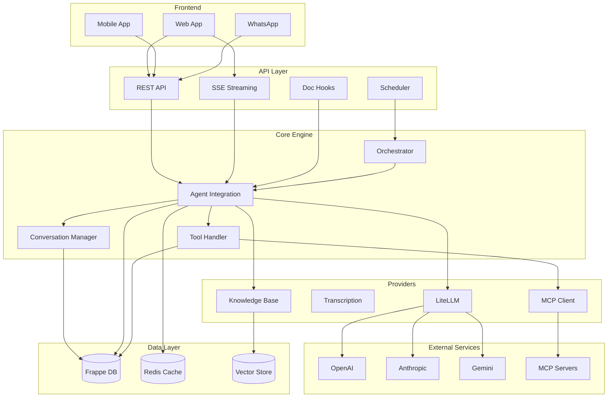
```mermaid
graph TB
    subgraph "Frontend"
        WEB[Web App]
        MOBILE[Mobile App]
        WA[WhatsApp]
    end
    
    subgraph "API Layer"
        REST[REST API]
        SSE[SSE Streaming]
        HOOK[Doc Hooks]
        SCHED[Scheduler]
    end
    
    subgraph "Core Engine"
        AI[Agent Integration]
        CM[Conversation Manager]
        TH[Tool Handler]
        ORCH[Orchestrator]
    end
    
    subgraph "Providers"
        LL[LiteLLM]
        TR[Transcription]
        KB[Knowledge Base]
        MCP[MCP Client]
    end
    
    subgraph "External Services"
        OAI[OpenAI]
        ANT[Anthropic]
        GGL[Gemini]
        MCPS[MCP Servers]
    end
    
    subgraph "Data Layer"
        DB[(Frappe DB)]
        CACHE[(Redis Cache)]
        VEC[(Vector Store)]
    end
    
    WEB --> REST
    WEB --> SSE
    MOBILE --> REST
    WA --> REST
    
    REST --> AI
    SSE --> AI
    HOOK --> AI
    SCHED --> ORCH
    
    AI --> CM
    AI --> TH
    AI --> LL
    AI --> KB
    
    ORCH --> AI
    
    TH --> MCP
    
    LL --> OAI
    LL --> ANT
    LL --> GGL
    
    MCP --> MCPS
    
    CM --> DB
    AI --> DB
    TH --> DB
    KB --> VEC
    AI --> CACHE
```

---

> **Nota**: Este documento describe la arquitectura de Huf v1.x. Para contribuir o reportar problemas, visita el repositorio en GitHub.
